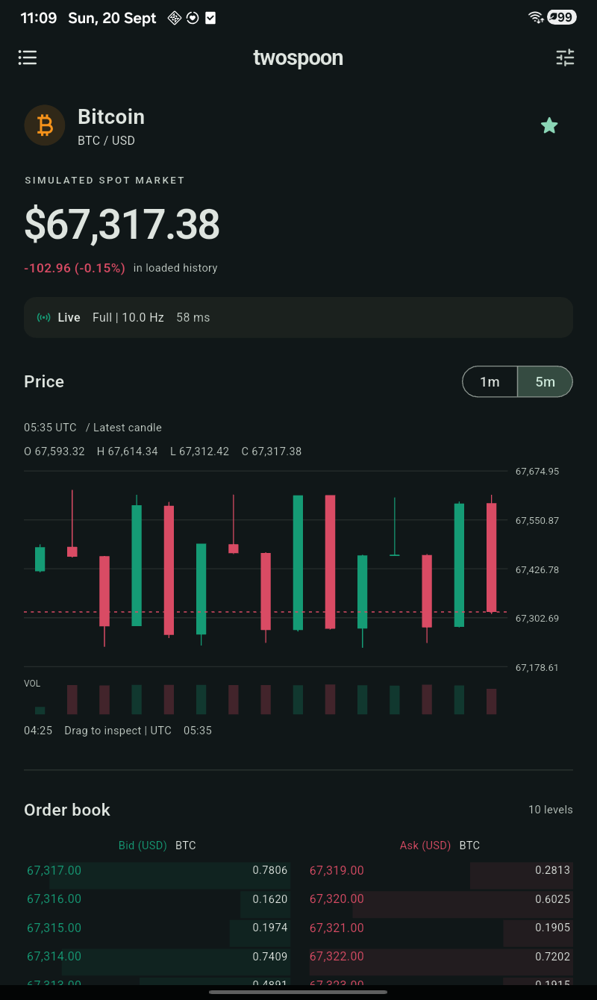
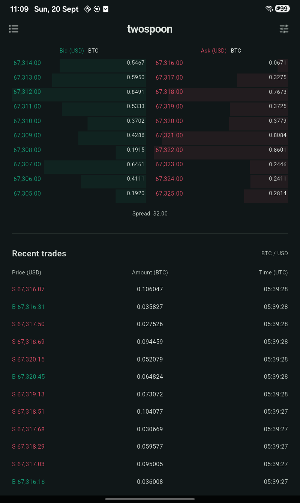

# TwoSpoon

A Flutter Android market screen and a deterministic FastAPI cryptocurrency simulator. There are no exchange accounts, external market feeds, real orders, or funds. BTC/USD is the only simulated instrument.

## Deliverables

- Public repository: `Prince2347X/twospoon-ai`
- Android APK: `mobile/build/app/outputs/flutter-apk/app-release.apk`
- [Physical-device screen recording](docs/media/twospoon-demo.mp4) (60 seconds)
- [Verification results and recording timeline](docs/verification.md): 11 backend tests, 12 Flutter tests, clean analysis, and physical Android interaction checks.

The prebuilt APK uses `http://10.0.2.2:8000` (Android emulator host). For a physical device, build with `--dart-define=API_URL=http://YOUR_COMPUTER_LAN_IP:8000`, or use the loopback/reverse setup below. The recording uses the existing physical-device debug build connected to the running backend; the release APK was built separately.





## Video demos
### Launch demo
https://github.com/user-attachments/assets/372bc522-7eee-4724-8e29-d9973cfd8cc3

### Physical-device demo
https://github.com/user-attachments/assets/482da8b7-ef04-43e5-b9ab-03f0636e9e9c


<video src="docs/media/twospoon-demo.mp4" controls title="TwoSpoon physical-device demo" width="280"></video>

## Run

Requires Python 3.12+, Flutter 3.41 / Dart 3.11+, and an Android SDK.

```powershell
python -m venv .venv
.venv/Scripts/python -m pip install -r backend/requirements.txt
```

Then start the backend with one command, from the repository root:

```powershell
.venv/Scripts/python -m uvicorn backend.market.app:app --host 0.0.0.0 --port 8000
```

Use **one worker**: the feed is an in-memory, single-process simulation. Initial history is generated at startup, so wait for `Application startup complete`. On macOS/Linux use `.venv/bin/python`.

```powershell
cd mobile
flutter pub get
flutter run --dart-define=API_URL=http://10.0.2.2:8000
flutter build apk --release
```

The Android emulator uses `10.0.2.2` to reach the host. A USB device can use `adb reverse tcp:8000 tcp:8000` and `--dart-define=API_URL=http://127.0.0.1:8000`. A physical device on Wi-Fi can use the computer's LAN address, with port 8000 allowed through the local firewall. The demo permits cleartext HTTP; use TLS/WSS and a restricted network-security policy before public deployment. The API URL is a build-time setting.

APK output: `mobile/build/app/outputs/flutter-apk/app-release.apk`. It uses Flutter's development signing configuration for assignment installation, not a Play Store release key.

## Architecture and state

- `backend/market/feed.py`: seeded integer-unit market, book and candle aggregation. It knows nothing about clients or delivery tiers.
- `backend/market/tiers.py`: pure per-connection adaptive-delivery state machine.
- `backend/market/app.py`: FastAPI REST snapshots, WebSocket protocol, bounded client queues and application lifespan.
- `mobile/lib/models/market.dart`: validated exact-unit models, order-book sequence recovery and candle reconciliation.
- `mobile/lib/network/transport.dart`: replaceable HTTP/WebSocket boundary using Dart's standard `dart:io` library.
- `mobile/lib/state/market_controller.dart`: ChangeNotifier application state, subscriptions, request generations, reconnect and metrics.
- `mobile/lib/ui/`: Material screen and custom-painted candles. UI does not fetch data or form market candles.

ChangeNotifier is sufficient for one screen and gives an easy-to-fake networking boundary without adding a state-management framework. Notifications are coalesced to at most 10 Hz. Lists are bounded (120 candles, 30 trades, 15 levels per book side), and painting is isolated in a RepaintBoundary. Candle inspection remains local widget state. UI supports system light/dark mode and scrolls on small displays. Wide layouts place book and trades alongside one another.

## Generated data and precision

The generator produces one trade every 100 ms using seed 42, a bounded mean-reverting random walk and slow price waves. Trade IDs strictly increase. A fixed seed and fixed start time reproduce trade values, quantities and book deltas exactly; the startup epoch is intentionally unique. Tests inject the start time. Startup computes 36,000 trades (one hour) for usable initial history. The 1m and 5m histories retain up to 600 candles each.

All protocol prices are **integer USD cents**, quantities/volumes are **integer millionths of BTC**, and timestamps are **UTC Unix milliseconds**. Prices and quantities remain integers in both domain models. Floating point is used only for chart coordinates, presentation and RTT statistics. Candles use half-open UTC buckets and the generated trade ordering; a revision is the latest included trade ID. The book has 15 bids and 15 asks with a positive spread; moving levels are explicitly deleted with zero quantities. This is a plausible visual simulator, not an exchange matching engine.

## API protocol

JSON over REST and WebSocket. `GET /health` is readiness information. `GET /v1/book` returns `{epoch, sequence, bids, asks}`; levels are `[price, quantity]`. `GET /v1/candles?interval=1m&limit=120` returns `{epoch, interval, candles}`. Supported intervals: `1m`, `5m`; limit 1-600. Candles contain `time, open, high, low, close, volume, revision`. REST query validation uses FastAPI's 422 response. Interactive REST documentation is at `/docs`.

Connect to `ws://HOST:8000/v1/stream`:

| Direction | Type | Fields / meaning |
| --- | --- | --- |
| Server | `hello` | `epoch`, `symbol`, `priceScale`, `quantityScale`; book streaming is registered before hello |
| Client | `subscribe` | `interval`, `requestId` |
| Server | `subscribed` | Echo interval/requestId and epoch |
| Server | `book` | `epoch`, `previous`, `sequence`, `bids`, `asks`; absolute replacement quantities, zero deletes |
| Server | `chart` | `epoch`, `interval`, `requestId`, `candles`, `trades`; authoritative candle replacements and recent trade window |
| Client / server | `ping` / `pong` | Echo integer `id` |
| Client | `metrics` | Nonnegative finite `latency` and `jitter`, in ms |
| Client | `forceTier` | `tier`: `full`, `degraded`, `minimal`, or null to restore automatic mode |
| Server | `status` | `tier`, `rate` (target maximum chart Hz), `override` |
| Server | `error` | `code: invalid_message`; recoverable malformed client input |

Trade objects contain `id, time, price, quantity, side` (`buy`/`sell`). Each connection has independent policy and subscription state. The status is sent periodically and after metrics or override changes. Unknown/malformed app messages are ignored with a diagnostic count and trigger recovery. Server validation rejects invalid JSON, types, intervals and nonfinite metrics. Each connection's outgoing queue is bounded to 128 messages; overflow closes with 1013. A three-second send timeout also terminates the connection. A slow client cannot stop the market generator or another client.

## Candle and book synchronization

**Candles:** subscribe, fetch REST history, then merge authoritative live updates by bucket timestamp and revision. A lower revision cannot overwrite a newer candle, including when REST finishes after live data. Duplicate buckets collapse. Interval changes clear the old series and increment a request ID. Both HTTP completions and WebSocket chart frames are checked against that ID and connection generation. A server epoch change clears old market data. Empty history is a valid waiting state; failed history has a retry action.

**Book:** open WebSocket first, buffer ordered deltas while the REST snapshot is in flight, discard buffered deltas already covered by the snapshot sequence, then apply only a chain with `previous == local sequence`. The snapshot's epoch must match the connection. Missing, duplicate/out-of-order live updates or an epoch mismatch mark the book stale and fetch a new snapshot. In-flight buffering is capped at 256 deltas; overflow also requires a new snapshot. Failed snapshot requests retry after 500 ms while the previous values remain explicitly stale. The top 10 bids/asks are derived from the locally maintained book, not polled from REST.

## Latency, jitter and adaptive delivery

The app sends an application-level WebSocket ping every two seconds. A monotonic Stopwatch measures RTT from send to matching pong, avoiding wall-clock adjustments. Latency is the arithmetic mean of the last 10 RTT samples. Jitter is the mean absolute difference between successive RTTs in that window (zero with only one sample). The app reports both after every matched pong. These are application RTT/jitter, including server queueing, not one-way network latency.

| Tier | Maximum chart rate | Automatic policy |
| --- | --- | --- |
| Full | 10 Hz | Initial tier; degrade if RTT >=250 ms or jitter >=60 ms |
| Degraded | 2 Hz | Recover to full only below 180 ms RTT AND 40 ms jitter |
| Minimal | 0.5 Hz | Enter if RTT >=800 ms or jitter >=180 ms; recover one step only below 500 ms RTT AND 100 ms jitter |

Two consecutive reports are required to worsen; four consecutive qualifying reports are required to improve one step. Neutral/opposite reports reset the candidate. A brief spike therefore does not flip the UI, and the lower recovery thresholds prevent oscillation. More than 15 seconds without a valid report forces the automatic policy to minimal. A debug override masks, but does not stop, the automatic policy; removing it immediately reveals the current automatic decision. A new connection begins at full with a fresh reporting window.

These rates balance a fluid local connection with fewer chart repaints on a delayed/jittery connection. They are target maxima, not a fabricated event source or measured FPS. All 10 trades/second always reach the market engine. Every trade updates exact OHLCV before delivery. Slower chart messages include **every candle revised since that client's previous delivery**, including the final state of a candle that closed between deliveries. Recent trades are a bounded recent window, not a lossless archive. Ordered book updates remain at the generator's rate in all tiers, because thinning individual deltas would break book correctness.

## Recovery, lifecycle and debug controls

On disconnect the app retains cached data with a stale indicator. It reconnects with exponential delays (1, 2, 4, 8, 16 seconds, plus up to 250 ms jitter), then resubscribes and refetches history/book. A silent socket or a pong outstanding over 10 seconds also triggers reconnect. Background/hidden/detached lifecycle states cancel connections, timers and subscriptions. Foreground reconnects and resynchronizes. Short inactive states, such as opening a system sheet, do not unnecessarily reconnect. Disposed controllers reject all late responses.

Tap the top-right sliders or connection strip to open **Connection lab**. Select automatic/full/degraded/minimal and observe the server-reported tier/rate. Turn on **Simulate disconnection** to close the real socket and retain stale values; turn it off to reconnect and recover. RTT, jitter, malformed-message count, book recoveries and observed chart Hz over the last five seconds are shown there. The initial five-second window ramps up; this measured rate is distinct from the target maximum. **Drop one book update** discards one incoming delta on purpose; the next sequence gap triggers a fresh REST snapshot and increments the recovery count.

Deep link: `twospoon://market/BTC-USD`.

```powershell
adb shell am start -W -a android.intent.action.VIEW -d "twospoon://market/BTC-USD" dev.twospoon.twospoon
```

The top-left button opens a reorderable watchlist. Bitcoin opens the live screen; Ethereum and Solana are explicitly unavailable placeholders, not fabricated live feeds. Reordering currently lasts for the app session.

## Verification

```powershell
python -m pytest backend/tests
cd mobile
flutter analyze
flutter test
flutter build apk --release
```

Backend tests cover hysteresis, missing reports, per-client overrides, deterministic trades, exact candles, book reconstruction, REST validation and real WebSocket sessions. Flutter tests cover buffered snapshot/delta recovery, epoch mismatch, out-of-order input, atomic malformed-candle rejection, revision merges, late interval HTTP responses, stale caches and disposal. Widget tests exercise narrow/wide layouts, larger text and chart inspection. See `docs/verification.md` for actual automated and physical-device results.

## Packages, references and limitations

Backend uses FastAPI, Uvicorn (WebSocket support), HTTPX and pytest. Mobile uses Flutter Material, dart:io networking and Flutter test/lints; no chart library or remote chart component is used. The generated Cupertino icon dependency is currently unused.

Implementation references: [FastAPI WebSockets](https://fastapi.tiangolo.com/advanced/websockets/), [Flutter simple state management](https://docs.flutter.dev/data-and-backend/state-mgmt/simple). Market information hierarchy was informed by [Coinbase's dashboard overview](https://help.coinbase.com/coinbase/trading-and-funding/advanced-trade/dashboard-overview) and [Kraken's trading interface guide](https://support.kraken.com/articles/kraken-pro-trading-interface-guide).

The demo has no persistence, authentication, public deployment, real exchange matching, order entry, or multi-worker coordination. Reconnect correctness is favored over maintaining an unbounded backlog. Cached values survive connection loss and backgrounding, not process termination. The physical-device recording demonstrates functionality; no release FPS benchmark is claimed. iOS would reuse the Dart application and protocol, add an iOS target with signing, associated URL handling and an appropriate ATS development exception, and verify lifecycle, VoiceOver, safe areas and physical-device performance. No iOS build is required or included.
